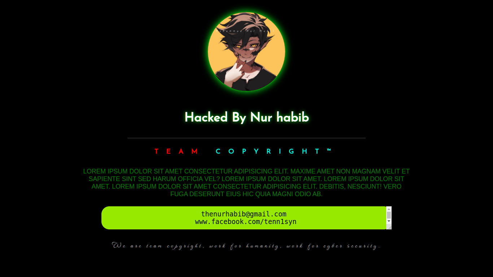

## Deface Page

A simple website deface page made with HTML5 & CSS3.

### Screenshot

### 🔗 Links

### 🚀 About Me
I'm a programmer & Linux System Administrator.

## Author

- [@Md. Nur habib](https://www.github.com/thenurhabib)

